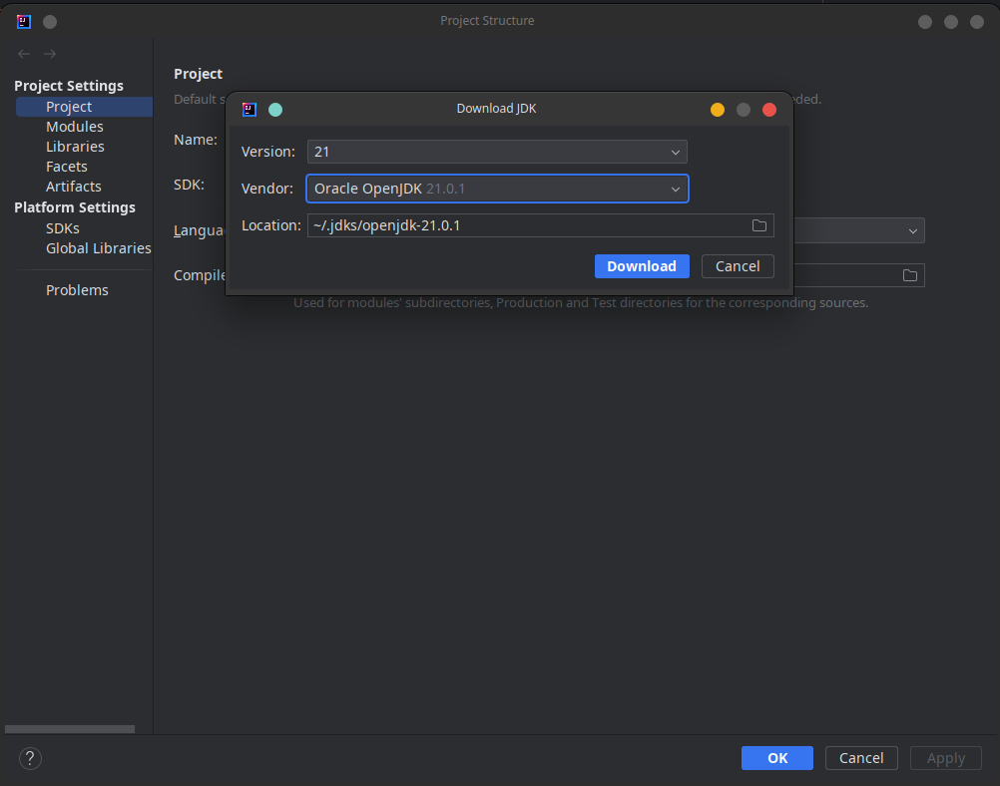

# ⏮ Before you start learning REST ASSURED

## 1- Prerequisites Knowledge

<figure><figcaption></figcaption></figure>

Java (Programming Language)

Online Documentation Resources to Learn Java from:

1. **Oracle's Java Tutorials:** Oracle provides comprehensive Java tutorials covering various Java topics. These tutorials are well-documented and suitable for beginners and intermediate developers.
   * [Oracle Java Tutorials](https://docs.oracle.com/javase/tutorial/)
2. **JavaPoint - Java Tutorial:** JavaPoint offers a series of articles covering Java programming concepts, from basics to advanced topics.
   * [JavaPoint Java Tutorial](https://www.javatpoint.com/java-tutorial)
3. **Baeldung - Java Tutorials:** Baeldung offers high-quality tutorials on Java and related technologies. Their tutorials cover a wide range of Java topics.
   * [Baeldung Java Tutorials](https://www.baeldung.com/get-started-with-java-series)
4. **GeeksforGeeks - Java Programming Language:** GeeksforGeeks is known for its detailed programming tutorials. Their Java section covers a wide range of topics with examples.
   * [GeeksforGeeks Java Programming Language](https://www.geeksforgeeks.org/java/)
5. **TutorialsPoint - Java Tutorial:** TutorialsPoint provides tutorials on Java programming with examples and a simple-to-understand format.
   * [TutorialsPoint Java Tutorial](https://www.tutorialspoint.com/java/index.htm)

***

Online Video Resources to Learn Java from:

1. **SDET - Java Full Course for Beginners** [**(Part 1)**](https://www.youtube.com/watch?v=\_3ds4qujpxU)  [**(Part 2)**](https://www.youtube.com/watch?v=l964iBiIAlo\&pp=ygUSamF2YSB0dXRvcmlhbCBzZGV0)  [**(Part 3)**](https://www.youtube.com/watch?v=u9VdSTXlHac\&pp=ygUSamF2YSB0dXRvcmlhbCBzZGV0)  [**(Part 4)**](https://www.youtube.com/watch?v=kpz3qfXr-Z0\&pp=ygUSamF2YSB0dXRvcmlhbCBzZGV0)
2. **Edureka - Java Tutorial For Beginners** [**(YouTube Playlist)**](https://www.youtube.com/playlist?list=PL9ooVrP1hQOHb4bxoHauWVwNg4FweDItZ)

TestNG (Java Testing Framework)

Online Documentation Resources to Learn TestNG from:

1. **TestNG Official Documentation:** The official TestNG documentation is an excellent resource to understand TestNG's features, annotations, and best practices.
   * [TestNG Official Documentation](https://testng.org/doc/documentation-main.html)
2. **Baeldung - TestNG Tutorial:** Baeldung offers a well-structured tutorial on TestNG, covering the basics and advanced features.
   * [Baeldung TestNG Tutorial](https://www.baeldung.com/testng)
3. **Guru99 - TestNG Tutorial:** Guru99 provides a TestNG tutorial with examples and sample test cases.
   * [Guru99 TestNG Tutorial](https://www.guru99.com/all-about-testng-and-selenium.html)
4. **ToolsQA - TestNG Tutorial:** ToolsQA offers a comprehensive TestNG tutorial with detailed explanations and examples.
   * [ToolsQA TestNG Tutorial](https://www.toolsqa.com/testng/testng-tutorial/)ToolsQA TestNG Tutorial
5. **Software Testing Material - TestNG Tutorial:** This tutorial covers TestNG annotations, data-driven testing, parallel test execution, and reporting.
   * [Software Testing Material TestNG Tutorial](https://www.softwaretestingmaterial.com/testng-tutorial/)

***

Online Video Resources to Learn TestNG from:

1. **SDET - TestNG with intelliJ IDE** [(YouTube Playlist)](https://www.youtube.com/playlist?list=PLUDwpEzHYYLsWENabqeETzgPLbmwqhM45)

Maven

Online Documentation Resources to Learn Maven from:

1. [Maven Official Documentation](https://maven.apache.org/guides/index.html)**:** The official documentation is a comprehensive resource for learning Maven, covering installation, configurations, and best practices.
2. [Baeldung Maven Tutorial](https://www.baeldung.com/maven)**:** Baeldung offers well-structured tutorials on Maven, including Maven plugins and profiles.
3. [Maven by TutorialsPoint](https://www.tutorialspoint.com/maven/index.htm)**:** TutorialsPoint provides a step-by-step Maven tutorial with examples for beginners.
4. [Guru99 Maven Tutorial](https://www.guru99.com/maven-tutorial.html)**:** Guru99 offers a Maven tutorial with practical examples, covering essential Maven concepts.

***

Online Video Resources to Learn Maven from:

1. **SDET - Apache Maven Tutorial** [**(Part 1)**](https://www.youtube.com/watch?v=-25Q76lnB50\&pp=ygUKc2RldCBtYXZlbg%3D%3D)  [**(Part 2)**](https://www.youtube.com/watch?v=cTzvrCm9P9E\&pp=ygUKc2RldCBtYXZlbg%3D%3D)  [**(Part 3)**](https://www.youtube.com/watch?v=BlI2NGarmvY\&pp=ygUKc2RldCBtYXZlbg%3D%3D)  [**(Part 4)**](https://www.youtube.com/watch?v=\_NGLNvF3D-A\&pp=ygUKc2RldCBtYXZlbg%3D%3D)&#x20;

Git

Online Documentation Resources to Learn Git from:

* **Git Official Documentation:** The official Git documentation is an extensive resource, covering everything from Git basics to advanced usage.
  * [Git Official Documentation](https://git-scm.com/doc)

<!---->

* **Atlassian's Git Tutorials:** Atlassian provides a series of Git tutorials and articles, suitable for beginners and experienced users.
  * [Atlassian Git Tutorials](https://www.atlassian.com/git)

<!---->

* **Git Cheat Sheet by GitHub:** GitHub provides a useful Git cheat sheet that summarizes Git commands and workflows.
  * [GitHub Git Cheat Sheet](https://education.github.com/git-cheat-sheet-education.pdf)

***

Online Video Resources to Learn Git from:

* **SDET - Git For Beginners** [**(YouTube Playlist)**](https://www.youtube.com/playlist?list=PLUDwpEzHYYLuMNNTu0EdWBeBtXdRhj4Lv)

***

## 2- Prepare your Development Environment

<figure><figcaption></figcaption></figure>

Install Git (Source version control system) 

Using Git with automation projects offers several advantages:

1. **Version Control:** Git tracks changes, allowing you to manage different versions of your automation code and scripts.
2. **Collaboration:** Facilitates teamwork by enabling multiple contributors to work on the same project simultaneously.
3. **Code Backup:** Provides a secure and remote backup of your automation code, reducing the risk of data loss.
4. **Change History:** Maintains a detailed history of code changes, making it easy to trace and revert modifications.
5. **Branching and Merging:** Supports branching for parallel development and efficient merging of code changes.
6. **Continuous Integration:** Easily integrates with CI/CD pipelines for automated testing and deployment.
7. **Code Review:** Simplifies code review processes, enhancing code quality and collaboration.
8. **Issue Tracking:** Links code changes to issues or feature requests for better project management.
9. **Open Source Collaboration:** Allows contributions to and collaboration on open-source automation projects.
10. **Community and Documentation:** Access to a vast community, tutorials, and documentation for best practices and support.

***

You can download and install Git from its website :arrow\_right: [here](https://git-scm.com/downloads)

Install IntelliJ Idea (IDE)

You can use any IDE you prefer, but what makes IntelliJ IDEA special:

1. **Smart Code Assistance:** Intelligent code suggestions and error checking.
2. **Wide Language Support:** Supports multiple programming languages.
3. **Version Control Integration:** Seamless Git and other VCS integration.
4. **Code Analysis:** Static code analysis and inspections.
5. **Rich Plugin Ecosystem:** Extensible with numerous plugins.
6. **Effective Project Navigation:** Quick navigation within projects.
7. **Powerful Debugging:** Feature-rich debugger for issue identification.
8. **Integrated Build Tools:** Supports Maven, Gradle, and more.
9. **User-Friendly Interface:** Clean and customizable workspace.
10. **Continuous Improvements:** Regular updates and enhancements.
11. **Cross-Platform:** Available for Windows, macOS, and Linux.
12. **Strong Community and Support:** Active user community and robust documentation.
13. **Educational Tools:** Features for educational projects.
14. **Multiple Editions:** Free Community and feature-rich Ultimate editions.

***

#### You can download it from :arrow\_right: [here](https://www.jetbrains.com/idea/download/)

Install OpenJDK 11

The minimum JDK version is 8 or higher for REST ASSURED, but we'll use version 11.&#x20;

OpenJDK 11 brings several important changes and improvements over older versions of the JDK, particularly when compared to Java 8, which was a widely used LTS (Long-Term Support) version. Here are some of the key aspects that make OpenJDK 11 special and differentiate it from older JDK versions:

1. **Modularity (JPMS):** Simplifies dependency management with the Java Platform Module System.
2. **Local Variable Type Inference:** Enhances code readability using the `var` keyword.
3. **New Features:** Introduces useful APIs like enhanced String methods and TLS 1.3 support.
4. **Garbage Collection:** Improved algorithms for better performance and reduced pauses.
5. **Performance:** Faster startup, enhanced garbage collection, and AOT compilation with GraalVM.
6. **LTS Support:** Java 11 is an LTS release, offering long-term support.
7. **Security:** Contains essential security updates for safer applications.
8. **Stability:** Rigorous testing ensures reliability for production use.
9. **Compatibility:** Maintains strong backward compatibility.
10. **Licensing:** Offers more permissive licensing compared to older versions.

***

**You can download OpenJDK from within IntelliJ IDEA by following these steps:**&#x20;

1. **Open IntelliJ IDEA:** Launch IntelliJ IDEA on your computer.
2. **Open Project Settings:**
   * For Windows and Linux: Go to "File" > "Settings."
   * For macOS: Go to "IntelliJ IDEA" > "Preferences."
3. **Project Settings:**
   * In the left pane, select "Project: \[Your Project Name]."
   * Then, select "Project" under the Project Settings category.
4. **Project SDK:**
   * Under the "Project SDK" section, click on the dropdown menu.
   * If you don't see an existing JDK, click "New..." to add a new one.
5.  **Configure New SDK:**

    * In the "Project SDK" dialog, select "Download..."
    * In the "Download JDK" window, you can select your preferred version of OpenJDK. Choose the one that suits your project requirements. IntelliJ IDEA will download and set up the JDK for you.

    <figure><figcaption>
"Download JDK" window
</figcaption></figure>
6. **Select JDK Version:**
   * After downloading, select the desired OpenJDK version from the list and click "Next."
7. **Accept the License Agreement:** Review the license agreement, and if you agree, click "Accept."
8. **Configure JVM Location:** Specify the directory where the OpenJDK should be installed, or you can use the default location. Click "Next."
9. **Summary:** Review the installation summary, and if everything looks correct, click "Finish."
10. **JDK Configuration:** The selected OpenJDK should now be added to your project as the Project SDK. Click "OK" or "Apply" to save the changes.

